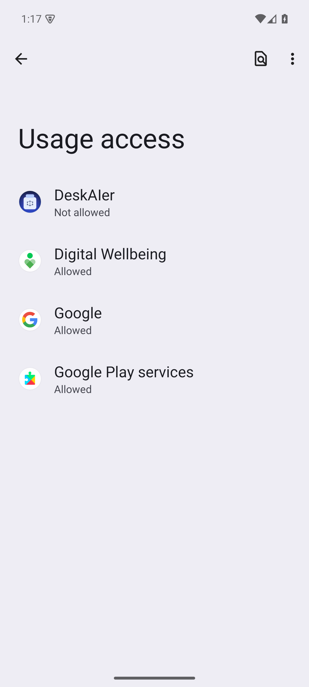



# Backup & Restore

## Export backup

- Settings > Local Backup > **Export backup**
- Generates a `.deskaier` file (including wallpapers)

## Restore backup

- Settings > Local Backup > **Restore backup**
- Supports `.deskaier / .zip / .json`
- Use “Restart now” after restore to apply immediately

## Notes

- Large files are supported via Android SAF stream fallback
- Broken/unsupported files show `Unsupported or broken backup file`

## Usage Access settings (for Smart Suggestions)

