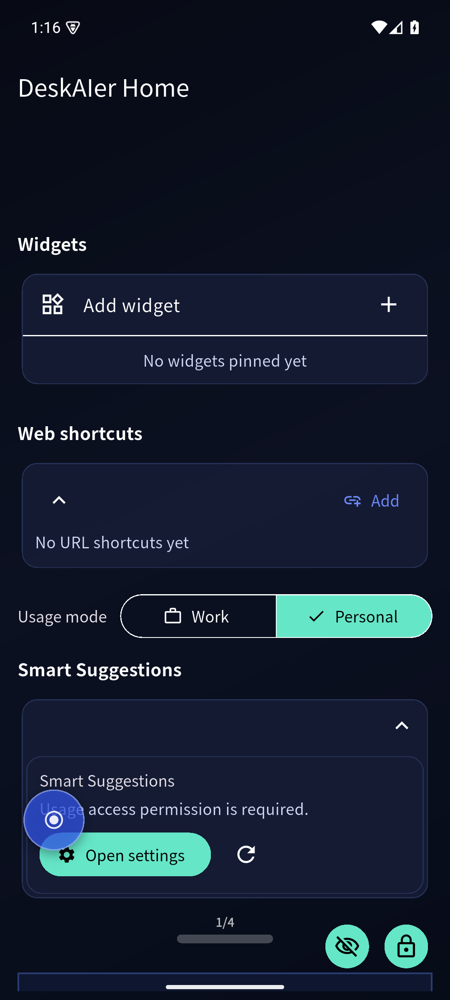
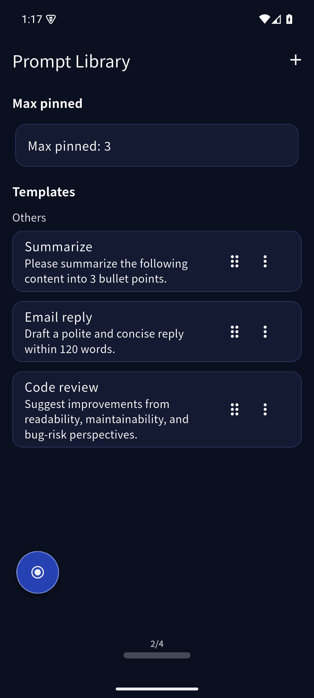
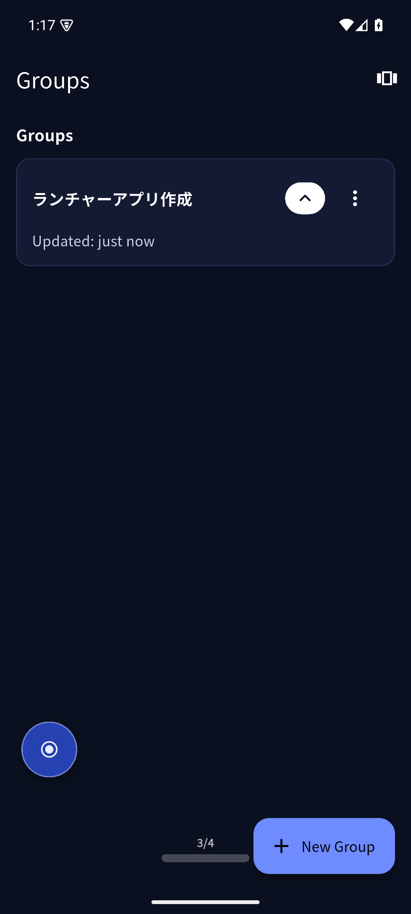



# Getting Started

## Screen walkthrough (English UI)

### Home

### Prompt Library

### Groups

### Tab list (`x/4`)

## First-time setup

1. Set DeskAIer as your home launcher
2. Grant required permissions
3. Tune section visibility from Settings

## Main areas

- **Home**: widgets, AI Quick Launch, web shortcuts
- **Groups**: pinned apps and folders
- **Settings**: display modes, backup, privacy

## AI Services

- You can toggle all AI services on/off in Platform settings
- You can also hide individual services from AI Quick Launch
