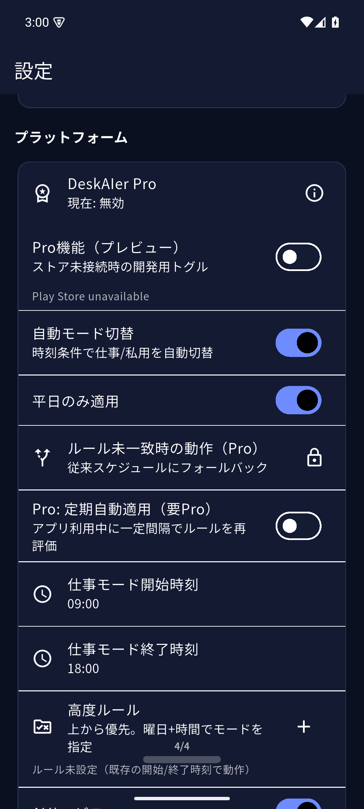
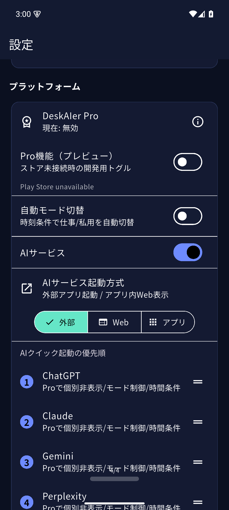
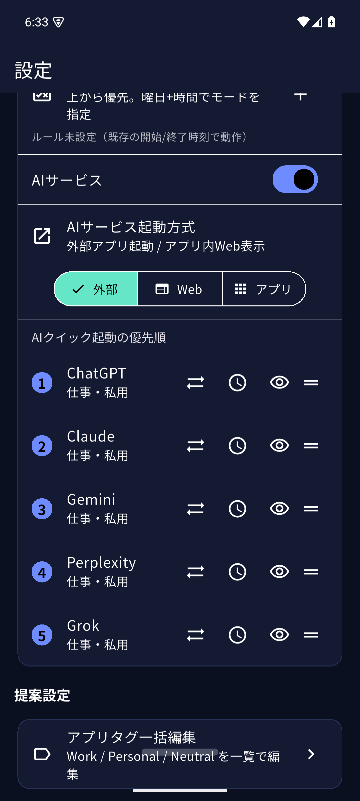
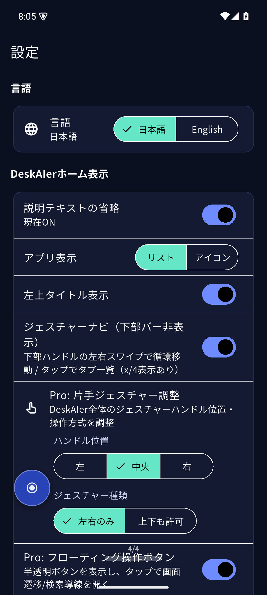
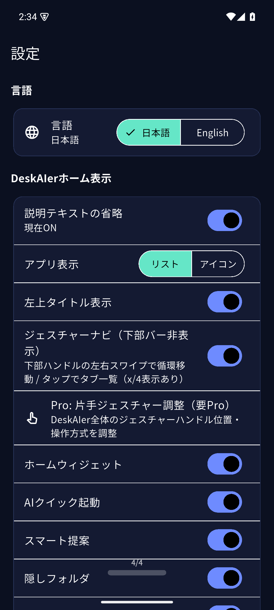
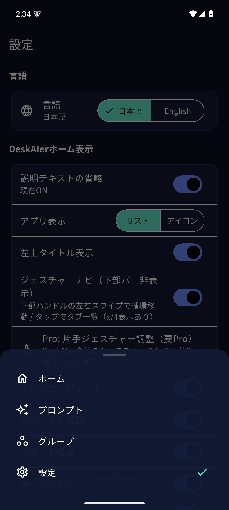
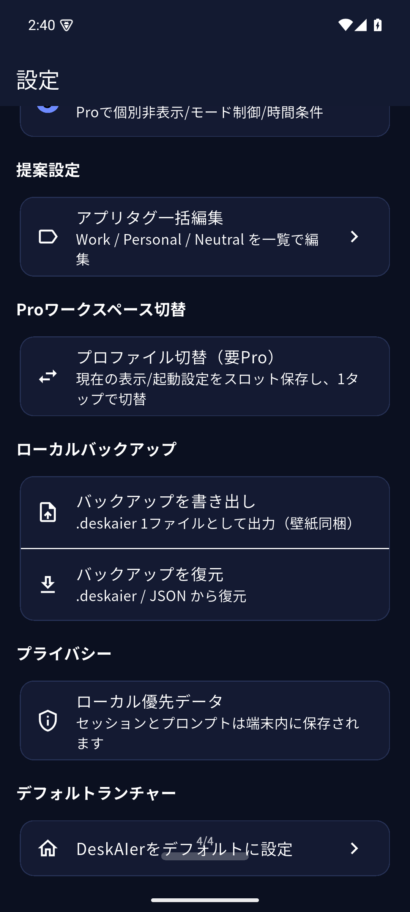



# Pro機能チュートリアル

> このページは公開向けです。内部情報（APIキー、秘密鍵、個人情報、未公開URL）は掲載しません。

## Pro導入チェックリスト

1. 設定 > **プラットフォーム** で `DeskAIer Pro` の状態を確認
2. 購入または復元後、表示が「現在: 有効」になっていることを確認
3. 有効化後、以下のいずれか1つを試す
   - AIクイック起動の優先順を変更
   - 自動モード切替のルールを1件追加
   - 片手ジェスチャー調整の設定を変更

## 1. Proの有効化

1. 設定 > **プラットフォーム** > **DeskAIer Pro** を開く
2. 月額または年額プランを選択
3. 購入後、表示が「現在: 有効」に変わることを確認
4. 必要に応じて「購入を復元」を実行

### うまくいかない場合

- ネットワーク接続を確認する
- アプリを再起動する
- Play ストアアプリを再起動して再試行する

---

## 2. AIクイック起動（Pro）

> 補足: 基本的なAIサービス表示は無料版でも利用できます。Proでは「サービスごとの詳細制御（表示/モード/時間条件）」が使えます。

### 2-1. サービスごとの表示/非表示

1. 設定 > **AIクイック起動の優先順**
2. 各サービス行の「目」アイコンで表示/非表示を切り替え

### 2-2. サービスごとのモード制御

1. 同じ画面で各サービス行のモードアイコンをタップ
2. 以下を切り替え
   - 仕事・私用
   - 仕事のみ
   - 私用のみ

### 2-3. 高度条件（曜日+時刻）

1. 各サービス行の「時計」アイコンをタップ
2. 有効化、曜日、開始/終了時刻を設定
3. 条件に一致した時だけそのサービスが表示される

---

## 3. 自動モード切替（Proオートメーション）

> まずは「平日 09:00-18:00 = 仕事モード」の1ルールから始めると、挙動確認がしやすいです。

### 3-1. ルール作成

1. 設定 > **自動モード切替** をON
2. **高度ルール** で「追加」
3. 曜日、時刻、モード（仕事/私用）を設定
4. ルールは上から優先で評価されるため、必要に応じて並び替え

### 3-2. ルール未一致時の動作（Pro）

設定可能な動作:

- 従来スケジュールへフォールバック
- 現在モードを維持
- 仕事モード固定
- 私用モード固定

### 3-3. 画面イメージ

---

## 4. Browser Pro

## 追加されたPro機能（最新）

### フローティング操作ボタン（アプリ内）

- 半透明の丸ボタンを表示
- タップでクイックメニュー（ホーム / プロンプト / グループ / 設定 / 検索導線）
- 固定OFF時はドラッグ移動、長押しで固定/解除
- 位置は保存され、再起動後も維持

設定場所:
- 設定 > **DeskAIerホーム表示** > **Pro: フローティング操作ボタン**
- 設定 > **DeskAIerホーム表示** > **ボタン位置を固定**

使い方の流れ:
1. Pro: フローティング操作ボタン をON
2. ボタンをタップして、画面遷移メニューを開く
3. 固定をOFFにしてドラッグ移動、位置が決まったら固定ON

### 画面イメージ（フローティング導線）

### 動画（MP4）

#### 1) ボタンタップでメニュー表示
<video controls playsinline preload="metadata" style="max-width: 100%; border-radius: 10px;">
  <source src="./assets/pro/fab-open-menu.mp4" type="video/mp4">
</video>

#### 2) ボタンをドラッグ移動（固定OFF）
<video controls playsinline preload="metadata" style="max-width: 100%; border-radius: 10px;">
  <source src="./assets/pro/fab-drag.mp4" type="video/mp4">
</video>

#### 3) 長押しで固定/解除
<video controls playsinline preload="metadata" style="max-width: 100%; border-radius: 10px;">
  <source src="./assets/pro/fab-lock-toggle.mp4" type="video/mp4">
</video>

#### 4) 自動モード切替の設定導線（高度ルール周辺）
平日設定や高度ルール追加までの導線を確認できます。
<video controls playsinline preload="metadata" style="max-width: 100%; border-radius: 10px;">
  <source src="./assets/pro/auto-mode-settings.mp4" type="video/mp4">
</video>

#### 5) AIクイック起動の優先順操作
表示順の変更や操作イメージを確認できます。
<video controls playsinline preload="metadata" style="max-width: 100%; border-radius: 10px;">
  <source src="./assets/pro/ai-quick-priority.mp4" type="video/mp4">
</video>

### Pro表示/課金導線の改善

- Pro有効時は「現在のプラン（月額/年額）」を表示
- Pro有効時は購入ボタンを非表示（復元のみ表示）
- 非加入時はProでできることを明示してから購入導線を表示

### 4-1. 片手操作UI

設定画面（4/4）の「Pro: 片手ジェスチャー調整（要Pro）」から、DeskAIer全体の片手ジェスチャー設定に進めます。

- 片手用UIの有効化
- バー位置（左/中央/右）
- ジェスチャー種類（左右のみ / フル）

### 4-2. セッション/同期機能

- タブセッション復元
- 固定タブ（Pinned tabs）
- Pro Sync（import/export）

---

## 5. 画面キャプチャ（追加）

### 5-1. 設定（Pro項目）

### 5-2. プラットフォーム設定（AIクイック起動の優先順 / Proワークスペース切替 など）

---

今後も、以下の導線キャプチャを継続追加します。

- 自動モード切替（高度ルール）
- Browser Pro（片手操作UIの詳細）
- 操作GIF（短尺）
