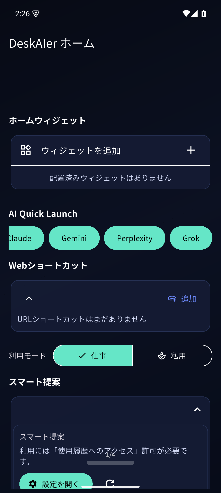
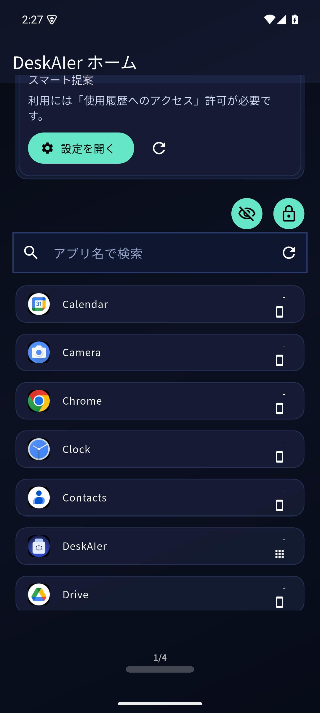
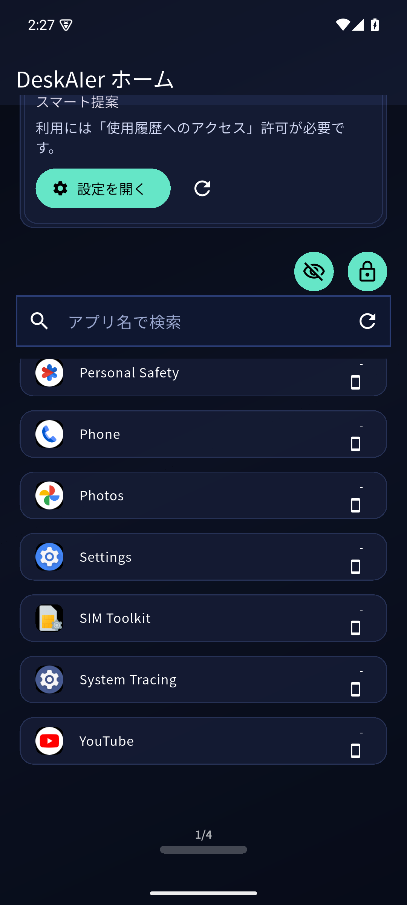
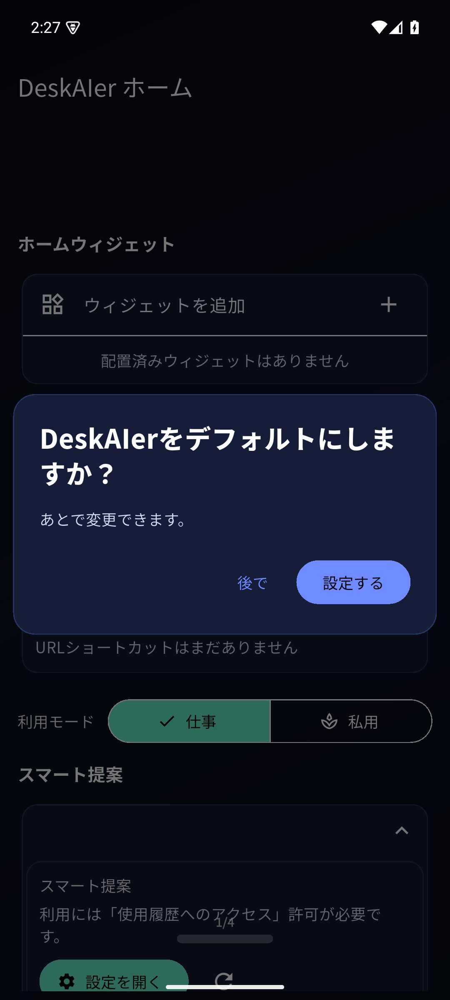
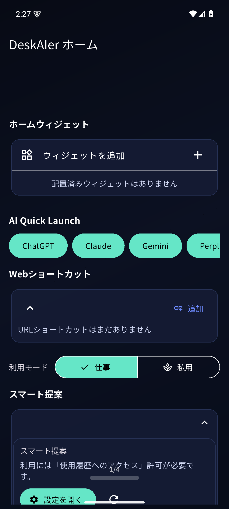
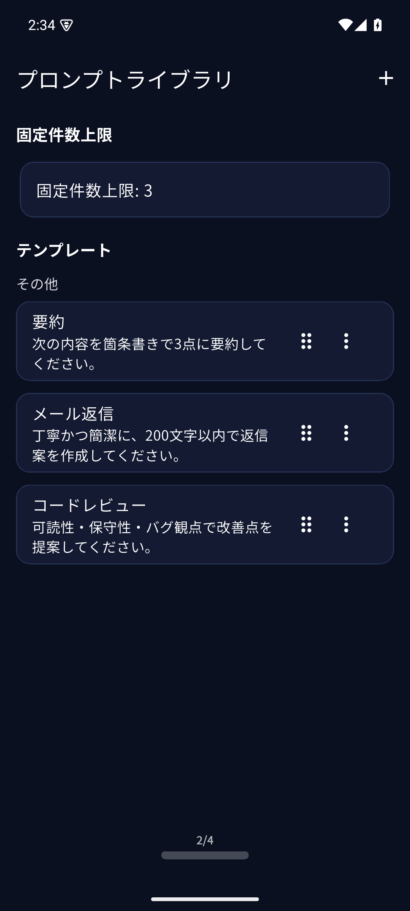



# ホーム画面と表示設定

## 画面イメージ（エミュレーター撮影）

### 1) ホーム全体

### 2) ホーム（スクロール位置 1）

### 3) ホーム（スクロール位置 2）

### 4) 使用履歴アクセスの設定画面

### 5) 設定画面から戻った後のホーム

## ホーム表示

DeskAIerホーム表示では、以下を個別に表示/非表示できます。

- ホームウィジェット
- AIクイック起動
- スマート提案
- Webショートカット
- ピン留め
- 隠しフォルダ

## 表示形式（リスト / アイコン）

次のセクションは表示形式を切り替えられます。

- Webショートカット表示形式
- スマート提案表示形式
- ピン留め表示形式

※ セクションが OFF の場合、対応する表示形式設定は自動で非表示になります。

## グループ内アプリ表示

- リスト
- アイコン
- リング

## タブ一覧と画面切り替え

下部の `x/4` 表示をタップすると、タブ一覧（ホーム / プロンプト / グループ / 設定）を開けます。

#### 動画（MP4）: タブ切り替えとジェスチャー操作
<video controls playsinline preload="metadata" style="max-width: 100%; border-radius: 10px;">
  <source src="./assets/pro/tab-gesture-nav.mp4" type="video/mp4">
</video>

### プロンプトライブラリ（2/4）

### グループ（3/4）

## 設定のおすすめ調整ポイント

### 1) ホーム表示のON/OFF

用途に合わせて以下を出し分けると、ホームの情報量を調整できます。

- ホームウィジェット
- AIクイック起動
- スマート提案
- Webショートカット
- ピン留め
- 隠しフォルダ

### 2) 表示形式（見やすさ優先）

迷ったら次の方針が使いやすいです。

- アプリ数が多い: **リスト表示**
- 直感操作重視: **アイコン表示**
- コンパクト表示: **リング表示**（グループ内）

### 3) ジェスチャーナビ

下部バーを非表示にしつつ、下部ハンドルでタブ移動できます。

- 左右スワイプ: タブを循環移動
- タップ: タブ一覧を開く（`x/4`）

### 4) Pro: 片手ジェスチャー調整

Pro利用時は、片手操作向けにハンドル位置/操作方式を調整できます。
詳しくは [Pro機能チュートリアル](./pro-features) を参照してください。
